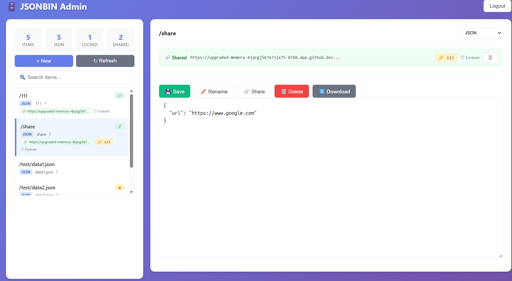
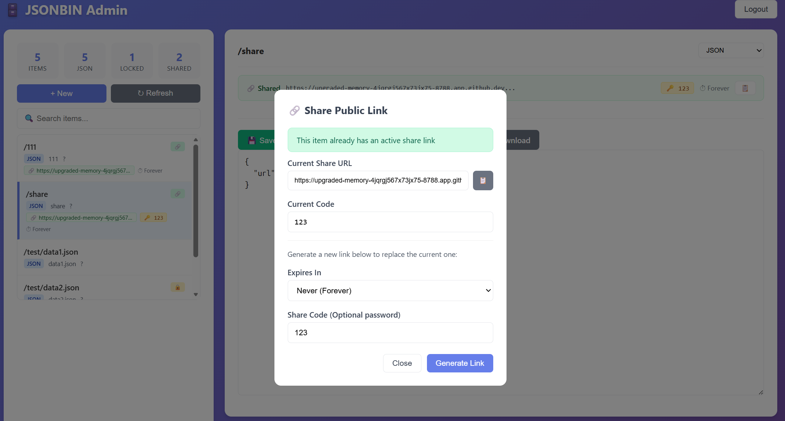
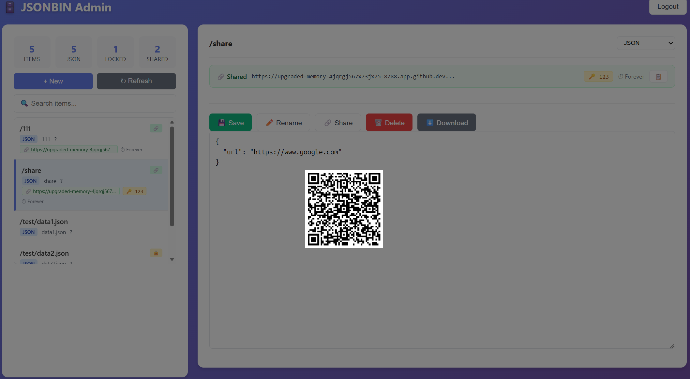

# json-bin

A simple json store based on cloudflare KV

### Feature
- Store Any Data: json, txt, image, pdf, binary file
- Share Public Link and QR Code
- Forward Your Request To Stored URL, just create a shared link, add extra path.


### Admin Usage
- create an item `/share`
```
{
  "url": "https://www.yourapi.com"
}
```
- create shared link with sharecode
```
https://upgraded-memory-4jqrgj567x73jx75-8788.app.github.dev/_download/iVmR1s4gtCRN7%2FwM%3Aa0O0lYj0uL%2FjmkKKYOUJ7FWQHcaDoTCgeg9s/share=123
```
- use it as an api forward or anything

```
curl "https://upgraded-memory-4jqrgj567x73jx75-8788.app.github.dev/_download/iVmR1s4gtCRN7%2FwM%3Aa0O0lYj0uL%2FjmkKKYOUJ7FWQHcaDoTCgeg9s/share=123/api"

# equals to
curl "https://www.yourapi.com/api"
```


### ScreenShot
```
https://jsonbin.your-account.workers.dev
```






### write

```bash
curl "https://jsonbin.your-account.workers.dev/test?key=yourapi" -d '{"url":"https://www.google.com"}'

curl "https://jsonbin.your-account.workers.dev/test?key=yourapi" --data-binary @data.json
curl "https://jsonbin.your-account.workers.dev/test?key=yourapi&q=url" -d "https://www.google.com"

```

### read

```bash
curl "https://jsonbin.your-account.workers.dev/test?key=yourapi"
curl "https://jsonbin.your-account.workers.dev/test?key=yourapi&q=url"

```

### direct to url

you should write json with `url` filed
then visit https://jsonbin.your-account.workers.dev/test?key=yourapi&redirect=1


## deploy on cloudflare

you can deploy this code on Workers or Pages

### create KV

Create a KV namespace
- visit https://dash.cloudflare.com
- navigate to Storage & Databases -> Workers KV -> Create Instance
- fill Namespace name `jsonbin`, then click Create

### Workers and Pages
- Create Project
- Import a repository

#### for workers

Build Command:

```bash
npm i
```

Deploy command:

```bash
npx wrangler deploy
```

#### for pages

Build Command:

```bash
npm i
```

Build output directory:

```
dist
```

- Environment variables (advanced) -> add Secret `APIKEYSECRET`
- after deployment, add Bindings, KV

| Type | Name | Value |
|------|------|-------|
| KV namespac | JSONBIN | jsonbin|


## development locally
> it's safe to share kv id in github
```bash
## run dev server
npx wrangler pages dev ./dist -k JSONBIN=jsonbin --compatibility-date=2025-10-08
npx wrangler dev --port 8788

## deploy to cf
npx wrangler pages deploy ./dist --project-name jsonbin --commit-dirty=true
npx wrangler deploy

```

```bash

# json
## json wirte read

#### upload file
curl "http://localhost:8788/test/data1.json?key=yourapi" -d @./data.json
### get file
curl "http://localhost:8788/test/data1.json?key=yourapi"
### get field
curl "http://localhost:8788/test/data1.json?key=yourapi&q=url"
curl "http://localhost:8788/test/data1.json?key=yourapi&q=name"
### update field
curl "http://localhost:8788/test/data1.json?key=yourapi&q=url" -d "http://www.bbc.com"
curl "http://localhost:8788/test/data1.json?key=yourapi&r=1" -i


### password
curl "http://localhost:8788/test/data2.json?key=yourapi&c=123" -d @./data.json
curl "http://localhost:8788/test/data2.json?key=yourapi&c=123"
curl "http://localhost:8788/test/data2.json?key=yourapi&c=123&q=name"

curl "http://localhost:8788/test/data2.json?key=yourapi&c=123&q=url" -d "http://www.bing.com"
curl "http://localhost:8788/test/data2.json?key=yourapi&c=123&r=1" -i


## forward
# https://upload.wikimedia.org/wikipedia/commons/5/57/Dogs_mating_2.jpg
curl "http://localhost:8788/share?key=yourapi&q=url" -d "https://upload.wikimedia.org"

curl "http://localhost:8788/_forward/yourapi/share/urlsplit/wikipedia/commons/5/57/Dogs_mating_2.jpg" -o wiki.jpg


curl "http://localhost:8788/wiki.json?key=yourapi&q=url" -d "https://en.wikipedia.org/"

curl "http://localhost:8788/_forward/yourapi/wiki.json/urlsplit/wiki/Kangaroo_rat" -i


# binary
curl "http://localhost:8788/test/wiki.jpg?key=yourapi" --data-binary @./wiki.jpg
curl -sSL -o wiki2.jpg "http://localhost:8788/test/wiki.jpg?key=yourapi&download"
```

### Reference
- https://jeromeetienne.github.io/jquery-qrcode/
- https://goqr.me/api/